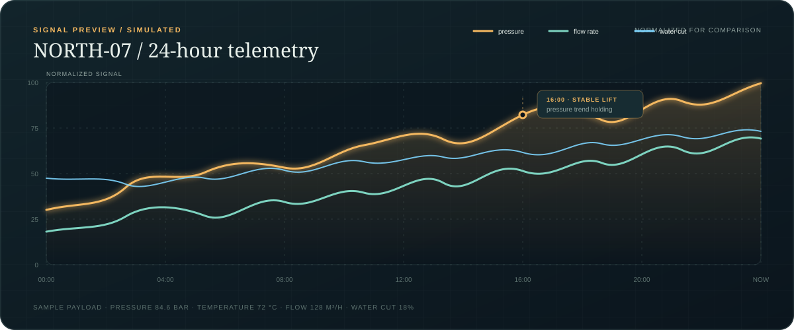
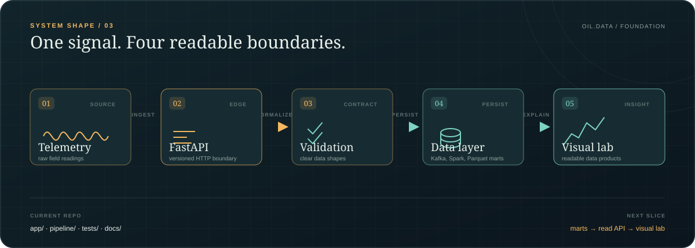

# Oil_data_back

> Async-first foundation for turning oil-field telemetry into clean, readable data products.

[](https://glec1er.github.io/Oil_data_back/)
[](https://www.python.org/)
[](https://fastapi.tiangolo.com/)

Oil Data Back is a compact backend playground for an oil-data service. The repository keeps the core intentionally small: FastAPI at the edge, async SQLAlchemy for persistence, Alembic for migrations, and a static visual lab that explains the direction of the project.

## Interactive showcase

The [GitHub Pages showcase](https://glec1er.github.io/Oil_data_back/) is the quickest way to understand the repository. It includes:

- an interactive signal explorer with pressure, temperature, flow, and water-cut controls;
- a deterministic sample payload generator with copy-to-clipboard;
- a visual architecture map for the current backend layers;
- a responsive, dependency-free interface that works as a static GitHub Pages site.

The playground is deliberately a front-end simulation. It makes the product direction visible without pretending that production telemetry already exists.

## Visual map

### Telemetry, at a glance

<p align="center">
  
</p>

<p align="center"><em>Deterministic sample data for the visual lab — not a live production feed.</em></p>

### How the layers connect

<p align="center">
  
</p>

The project is intentionally easy to scan: readings enter through a versioned API boundary, become validated data, move through async persistence, and surface as an understandable insight.

## What is in the repository

| Part | Role | Status |
| --- | --- | --- |
| `pipeline/` | Kafka → Spark → Bronze / Silver / hourly + daily Parquet marts, replay, verification | Working, tested |
| `app/` | FastAPI shell with `GET /api/v1/health`, async SQLAlchemy foundation | Foundation |
| `docs/` | Interactive GitHub Pages showcase | Ready |
| `design/specs/` | Design documents | Reference |

## Quick start

Run the telemetry pipeline (needs Docker):

```bash
make up         # Kafka + Spark processors
make scenario   # duplicates, a late schema-v2 event, bad input, restarts, replays
make verify     # observed vs expected counts and aggregates; nonzero exit on mismatch
make down       # stop, keeping Kafka, Parquet and checkpoint volumes
```

Run the tests and the API shell without Docker:

```bash
python3 -m venv .venv && source .venv/bin/activate
pip install -r requirements/dev.txt
pytest
uvicorn app.main:app --reload
```

The static showcase needs neither Python nor a database:

```bash
python3 -m http.server 8080 --directory docs
```

## Project map

```text
app/          # FastAPI shell, settings, async database foundation
pipeline/     # contract, generator, Spark jobs, transform, snapshots, verify, CLI
tests/        # unit tests and an in-process recovery scenario
design/       # specs
docs/         # GitHub Pages showcase
alembic/      # migrations configuration
scripts/      # end-to-end scenario
```

## Scale limits

Each materialization rereads all of Bronze, which favors clear late-event correction and replay over throughput. It is sized for a local fixture, not production volume. Kafka retention must exceed any planned processor outage.

## Documentation

- [Interactive overview](docs/index.html)
- [Architecture notes](docs/architecture.md)
- [Playground guide](docs/demo.md)
- [Development notes](docs/development.md)
- [Pipeline design](design/specs/2026-10-03-telemetry-pipeline-design.md)

## Direction

Next: a read API over the marts through `active.json`, then connecting the visual lab to real aggregates.

## License

No license has been selected yet. Add one before publishing this project for reuse.
